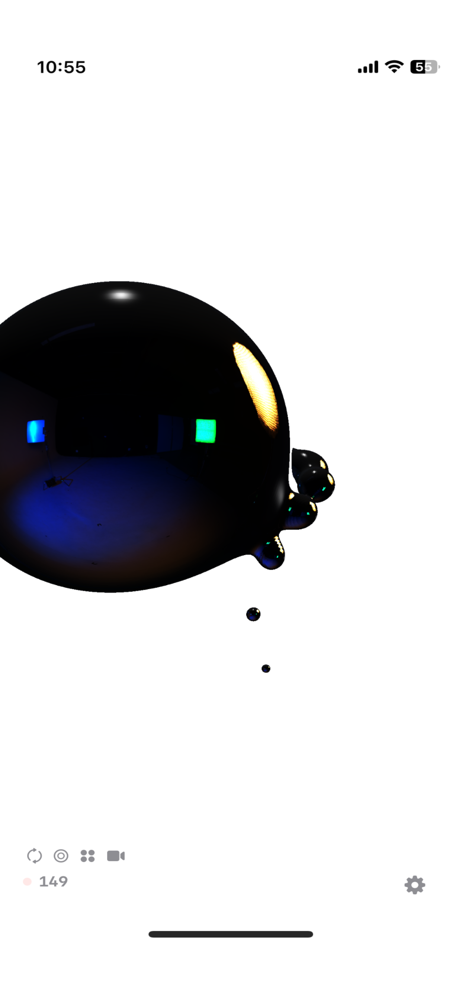
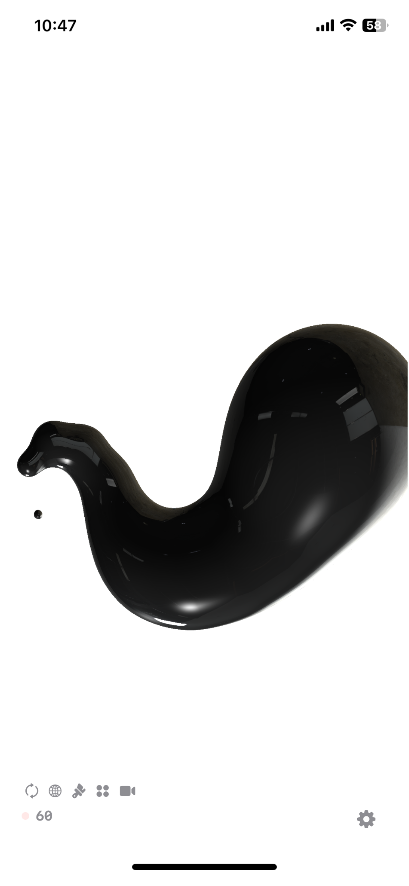
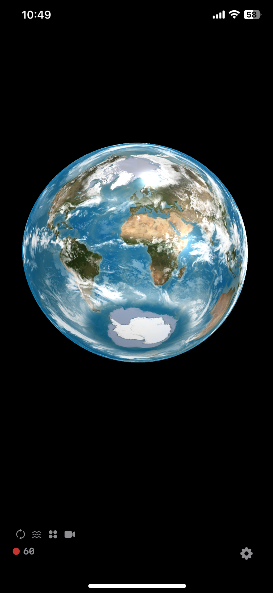
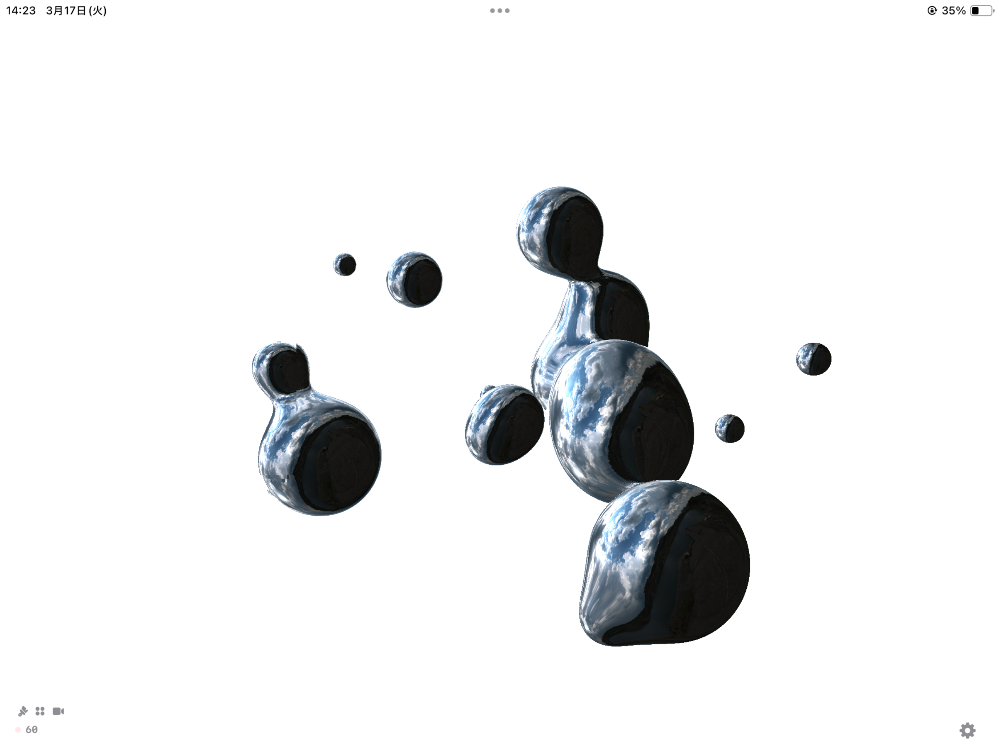

# Magnetic

## Real-time 3D metaball visualizer powered by Metal shaders.

Watch liquid metal shapes merge, split, and flow —
all rendered in real time on your iPhone.
React to music through your microphone,
or let the built-in BPM engine drive the motion.

---
Metalシェーダーで駆動する、リアルタイム3Dメタボールビジュアライザー。
液体金属のような形状が融合・分裂・流動する様子を、iPhoneでリアルタイムレンダリング。
マイクで音楽に反応させたり、内蔵BPMエンジンでモーションを制御。

---

## Key Features

- Real-time ray-marched 3D metaballs
- 5 material modes: Black, Mercury, Glass, Custom Color, Wireframe
- 12+ HDRI environment maps (studio, nature, planetary)
- Custom photo environment maps
- Audio-reactive mode with microphone input
- Manual BPM control for rhythm sync
- 9 orbit patterns: Random, Circle, Sphere, Torus, Spiral, Satellite, DNA, Figure-8, Wave
- Long-press zoom / spin with inertia
- Individual parameter locking
- Camera mode with cinematic auto-movement
- Double-tap to randomize everything
- Screen recording & green screen mode

---
- リアルタイム・レイマーチング3Dメタボール
- 5種のマテリアル: Black, Mercury, Glass, Custom Color, Wireframe
- 12以上のHDRI環境マップ（スタジオ、自然、惑星）
- カスタム写真を環境マップに使用可能
- マイク入力によるオーディオリアクティブ
- BPM手動制御
- 9種のオービットパターン
- 長押しズーム・スピン（慣性付き）
- パラメータ個別ロック
- シネマティックカメラモード
- ダブルタップでランダマイズ
- 画面録画・グリーンスクリーン対応

## Screenshots

  
  &nbsp;&nbsp;
  
  &nbsp;&nbsp;
  

  

---

## Tech Stack

- **Swift** + **Metal Shading Language**
- **SwiftUI** (async/await, no Combine)
- **MetalKit** for GPU rendering
- Fragment shaders with SDF ray marching

---

## Status

Currently under active development.
